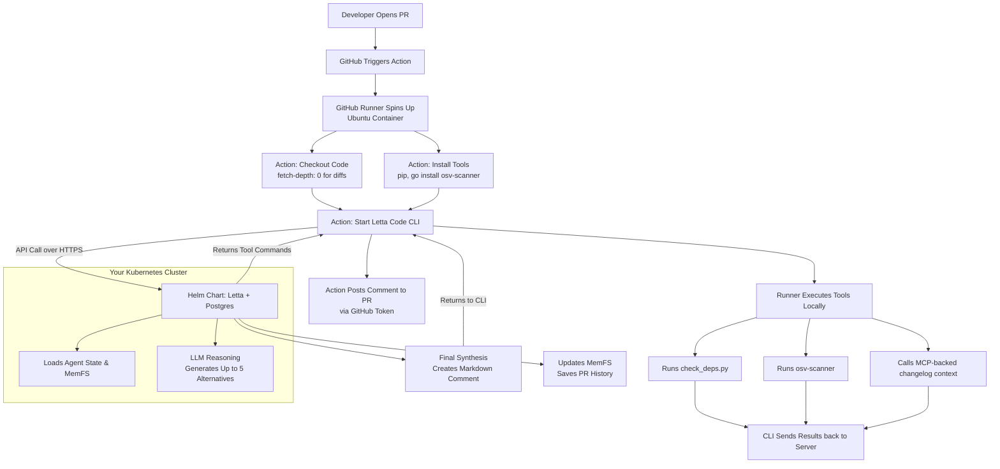

# Plan 2 Addendum: Actual Cluster Baseline for the GitHub Actions + Self-Hosted Letta Split

## Purpose of this addendum

This addendum exists to record the Kubernetes cluster configuration we actually intend to run, then reshape Plan 2 around that reality. It supersedes any Plan 2 text that assumes we should redesign the cluster to match an earlier conceptual architecture.

The governing decision is a split-responsibility model:

- GitHub Actions is the trigger and execution surface.
- The GitHub runner hosts the hands: repository checkout, file access, shell execution, and any repo-local audit scripts or scanners.
- Kubernetes hosts the brain: Letta Server, its persistent backing services, and the ingress/TLS/secrets needed to expose it reliably.
- The cluster burden should remain minimal and intentional.

## GitHub Actions vs. custom webhooks

We are using GitHub Actions. We are not building a custom webhook receiver.

The reason is straightforward: a custom webhook receiver in Kubernetes would force us to build and operate a mini-CI/CD system from scratch. That means accepting GitHub events, validating signatures, cloning the repository, computing diffs, managing GitHub credentials, handling retries, and coordinating local audit tooling inside the cluster.

The GitHub Actions path already gives us all of that:

- GitHub triggers the workflow natively.
- The runner already has the repository checkout.
- The runner already has the GitHub token and PR context.
- The workflow can install runner-side tools on demand.
- Letta only needs to act as the remote agent service.

This keeps custom Kubernetes work low, which is a core requirement for this architecture.

## Complete execution flow



## Architecture correction and superseded assumptions

Plan 2 should no longer assume a direct GitHub webhook receiver, a webhook sidecar, or pod-local repository cloning as the primary execution path. Those ideas were useful for exploring a fully in-cluster design, but they are not the chosen architecture.

This addendum replaces that model with a GitHub Actions driven flow:

1. A pull request event triggers a GitHub Actions workflow.
2. The runner checks out the repository and provides the working filesystem context.
3. The workflow invokes Letta Code against a self-hosted Letta endpoint using `letta_base_url`.
4. The Letta server handles agent state, memory, model/provider connectivity, and conversation persistence.
5. Any custom scripts or scanners used during review must be available on the runner, not assumed to exist only inside the Kubernetes image.

In other words: Kubernetes is the remote agent service, not the place where the PR workspace lives.

## Minimal Kubernetes footprint

The target cluster footprint for Plan 2 is intentionally small:

- PostgreSQL with pgvector, if required by the chosen Letta deployment path.
- Letta Server.
- Existing ingress layer plus `cert-manager` for certificate management.
- Doppler Operator for cluster-side secret delivery.

This addendum explicitly avoids adding new always-on cluster components unless live requirements force them. That means no custom webhook receiver, no queue, no Redis, no worker pool, and no repo-cloning service in the first version.

If later scale or reliability data justifies more infrastructure, that should be introduced as a separate operational decision, not smuggled into the baseline architecture.

## GitHub Actions workflow shape

The workflow should be treated as the operational front door for PR reviews.

Baseline expectations for the workflow are:

- Trigger on pull request open and synchronize events.
- Check out the repository on the runner.
- Install or expose any runner-side tools needed for dependency and architecture review.
- Call the Letta Code action with the self-hosted Letta base URL.
- Keep the permission model advisory-only.

This has an important consequence for Plan 2: tool packaging moves out of the “custom K8s image as the tool host” mindset. If the agent needs `osv-scanner`, a repo script, or another helper, that dependency must be installed in the workflow or kept in the repository so the runner can use it directly.

The Letta image should therefore be scoped around serving Letta reliably, not around bundling the entire review toolchain.

## Secrets management with Doppler

We should not manage long-lived Kubernetes `Secret` manifests by hand for this deployment. The default assumption for this architecture is the Doppler Kubernetes Operator.

That model looks like this:

1. Install the Doppler Operator in the cluster.
2. Create a Doppler service token for the project.
3. Create a `DopplerSecret` resource that syncs managed secrets into a native Kubernetes Secret.
4. Reference the synced Kubernetes Secret from the Letta deployment.

Example:

```yaml
apiVersion: secrets.doppler.com/v1alpha1
kind: DopplerSecret
metadata:
  name: letta-doppler-secrets
  namespace: ai-agents
spec:
  tokenSecretRef:
    name: doppler-token
  managedSecret:
    name: letta-secrets
    namespace: ai-agents
```

Then the Letta deployment can consume it with:

```yaml
envFrom:
  - secretRef:
      name: letta-secrets
```

This keeps Doppler as the source of truth while still presenting the app with normal Kubernetes secret wiring.

## TLS and certificates with cert-manager

The GitHub Action runner needs to talk to the Letta endpoint over HTTPS. Self-signed certificates are not a good fit here because hosted runners will reject them unless extra trust bootstrapping is added.

The default production path should be:

- existing ingress controller
- `cert-manager`
- Let’s Encrypt
- the real hostname intended for the Letta API endpoint

Example ingress shape:

```yaml
apiVersion: networking.k8s.io/v1
kind: Ingress
metadata:
  name: letta-server-ingress
  namespace: ai-agents
  annotations:
    cert-manager.io/cluster-issuer: "letsencrypt-prod"
spec:
  tls:
    - hosts:
        - letta.yourdomain.com
      secretName: letta-tls
  rules:
    - host: letta.yourdomain.com
      http:
        paths:
          - path: /
            pathType: Prefix
            backend:
              service:
                name: letta-server
                port:
                  number: 8283
```

The plan should capture and reuse the cluster’s existing issuer, ingress class, namespace conventions, and DNS pattern instead of inventing a parallel ingress story inside the document.

## Cluster facts to capture before finalizing manifests

Before Plan 2 is rewritten into manifests or exact deployment steps, this addendum should be backfilled from the live cluster with the facts that materially shape the deployment:

- namespace choice
- ingress class or controller
- public hostname for Letta
- `cert-manager` issuer or cluster issuer
- DNS ownership and update path
- Postgres operating model
- storage class and persistence expectations
- Doppler Operator object pattern and secret naming
- network exposure and authentication constraints for the Letta endpoint
- image pinning and upgrade policy

The point is to make Plan 2 describe the cluster we have, not a hypothetical cluster from scratch.

## Open infrastructure questions to gather from the real cluster later

1. Are we using GitHub-hosted runners or self-hosted runners, and does that mean the Letta endpoint must be publicly reachable or only privately reachable?
2. What namespace should this actually live in, and is there an existing convention for app, data, and operator resources?
3. What ingress controller and ingress class are already in use?
4. Does `cert-manager` already have a working `ClusterIssuer` or `Issuer` for Let’s Encrypt, and what is its exact name?
5. What hostname should the Letta API use, and who owns the DNS update path?
6. Is Postgres new for this app, shared, or already present in-cluster, and how is `pgvector` handled today?
7. What storage class should back Postgres and any Letta persistent state?
8. How is Doppler Operator currently modeled in this cluster: one secret per app, one per namespace, or some other pattern?
9. Which secrets belong only in-cluster, and which still need a GitHub-side delivery path for the workflow?
10. What auth model should protect the Letta endpoint from the runner: password, API key, IP restrictions, or a combination?
11. Are there existing network policies, egress controls, or WAF constraints that affect Letta or model-provider access?
12. What observability already exists for app pods, ingress, and Postgres, and what should Plan 2 rely on instead of inventing new monitoring?

## How this addendum changes the rest of Plan 2

This addendum should drive concrete edits to the main plan:

- Remove or mark superseded any sections that describe a custom GitHub webhook receiver as the primary trigger.
- Remove or mark superseded any sections that assume the Kubernetes pod clones repositories and executes review tools against a pod-local workspace.
- Replace “custom Letta image with bundled audit tooling” with “minimal Letta service image plus runner-side workflow bootstrap.”
- Rewrite the deployment stages so they begin with real cluster discovery, then map Letta, Postgres, ingress, TLS, and Doppler onto that existing shape.
- Add a short architecture note that the GitHub runner hosts the hands and Kubernetes hosts the brain.

This keeps Plan 2 self-hosted where it matters, while staying honest about where the code actually runs.
